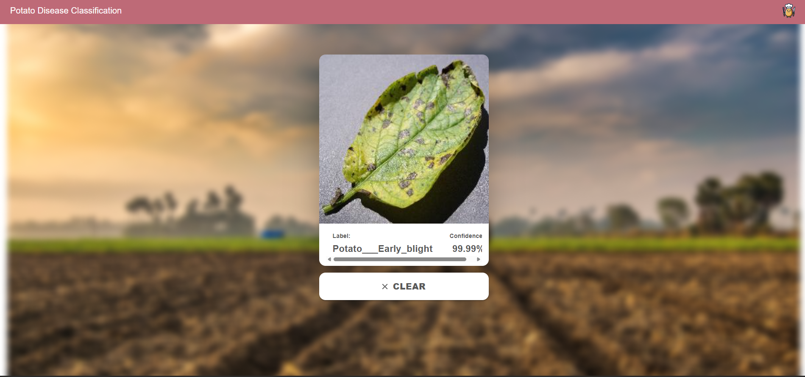

# 🥔 Potato Disease Classification

A deep learning web app that detects potato leaf diseases from images with **99.99% confidence** using a CNN model served via FastAPI and React.



---

## 🌿 Demo

> Upload a potato leaf photo → Get instant disease classification

**Live App:** [potato-disease-classification-cnn-2.onrender.com](https://potato-disease-classification-cnn-2.onrender.com)

---

## 🧠 What It Detects

| Disease | Description |
|---|---|
| 🟡 Early Blight | Fungal disease causing dark spots with yellow rings |
| 🔴 Late Blight | Serious disease that destroyed the Irish potato famine |
| 🟢 Healthy | No disease detected |

---

## 🏗️ Architecture

React (UI) → FastAPI (Backend) → CNN Model (TensorFlow)
:3000          :8000                 1.keras

---

## 🛠️ Tech Stack

| Layer | Technology |
|---|---|
| Frontend | React JS, Material UI |
| Backend | FastAPI, Python |
| ML Model | TensorFlow, Keras (CNN) |
| Serving | TF Serving, Docker |
| Deployment | Render (Free Tier) |

---

## 📁 Project Structure

```text
potato-disease-classification-cnn/
├── api/
│   ├── main.py                 # FastAPI (direct model)
│   ├── main-tf-serving.py      # FastAPI (TF Serving)
│   └── requirements.txt
├── frontend/
│   └── src/
│       ├── App.js
│       └── home.js             # Main UI component
├── models/
│   ├── 1.keras                 # Trained Keras model
│   └── potatoes_model/1/       # SavedModel for TF Serving
├── training/                   # Jupyter notebooks
└── models.config               # TF Serving config
```
---

## 🚀 Run Locally

### 1. Clone the repo
```bash
git clone https://github.com/srinitish/potato-disease-classification-cnn.git
cd potato-disease-classification-cnn
```

### 2. Start the API
```bash
cd api
pip install -r requirements.txt
python main.py
```

### 3. Start TF Serving (optional)
```bash
docker run -t --rm -p 8501:8501 \
  -v "$(pwd):/potato-disease" \
  tensorflow/serving \
  --rest_api_port=8501 \
  --model_config_file=/potato-disease/models.config
```

### 4. Start the frontend
```bash
cd frontend
npm install
npm start
```

Open `http://localhost:3000` in your browser.

---

## 🧪 Model Details

| Parameter | Value |
|---|---|
| Architecture | CNN (Convolutional Neural Network) |
| Input Size | 256 × 256 × 3 |
| Batch Size | 32 |
| Epochs | 30 |
| Classes | 3 (Early Blight, Late Blight, Healthy) |
| Dataset | PlantVillage (TF Dataset) |
| Data Augmentation | Yes |

---

## 📡 API Endpoints

| Method | Endpoint | Description |
|---|---|---|
| GET | `/ping` | Health check |
| POST | `/predict` | Predict disease from image |

### Example Request
```bash
curl -X POST "http://localhost:8000/predict" \
  -H "accept: application/json" \
  -F "file=@potato_leaf.jpg"
```

### Example Response
```json
{
  "class": "Potato___Early_blight",
  "confidence": 0.9999
}
```

---

## 🐳 Docker

TF Serving runs inside Docker because it is a Linux-only program. Docker creates a mini Linux environment on Windows and mounts your model files into it.
```bash
docker run -t --rm -p 8501:8501 \
  -v "C:\path\to\potato classification:/potato-disease" \
  tensorflow/serving \
  --rest_api_port=8501 \
  --model_config_file=/potato-disease/models.config
```

---

## ☁️ Deployment

| Service | Platform | URL |
|---|---|---|
| Frontend | Render Static Site | [Live](https://potato-disease-classification-cnn-2.onrender.com) |
| Backend API | Render Web Service | [Live](https://potato-disease-classification-cnn-1.onrender.com) |

---

## 👨‍💻 Author

**Srinitish** — [@srinitish](https://github.com/srinitish)

---

## ⭐ Star this repo if you found it helpful!
